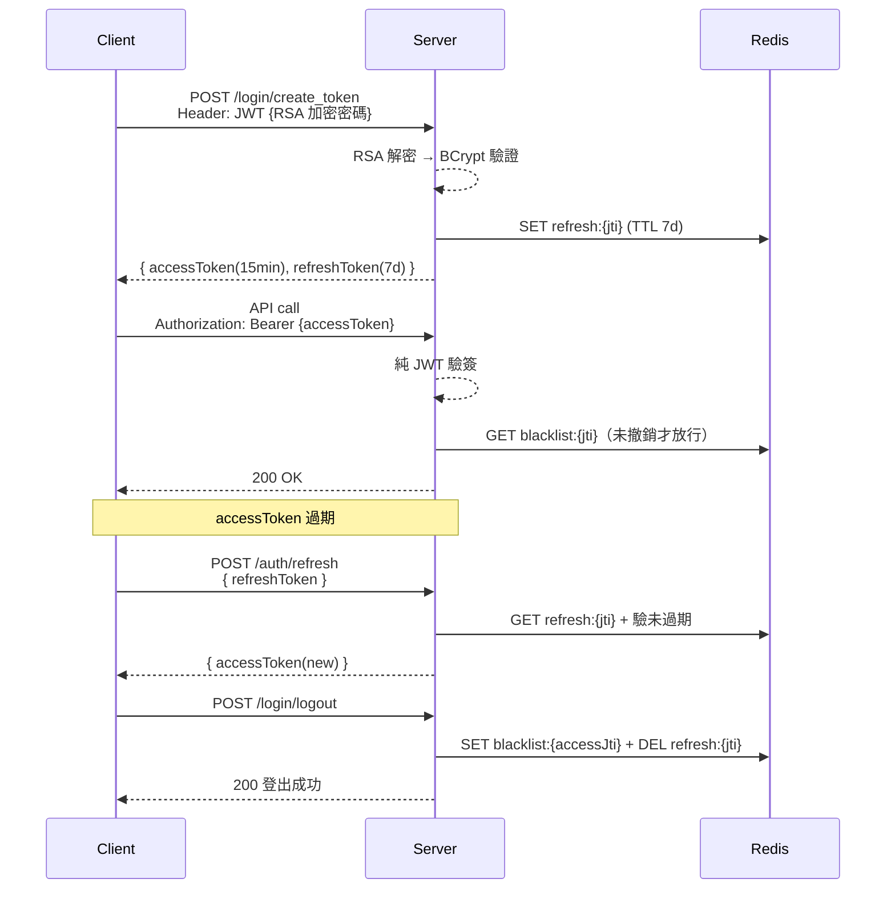
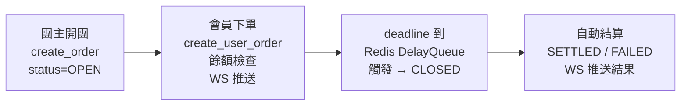
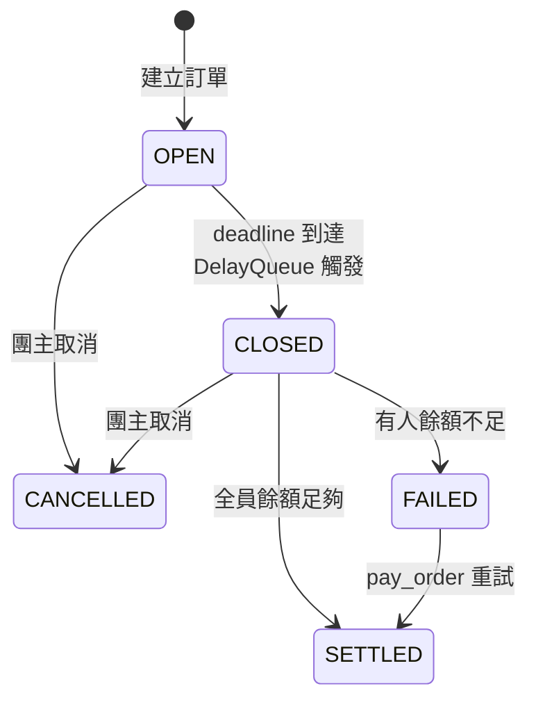
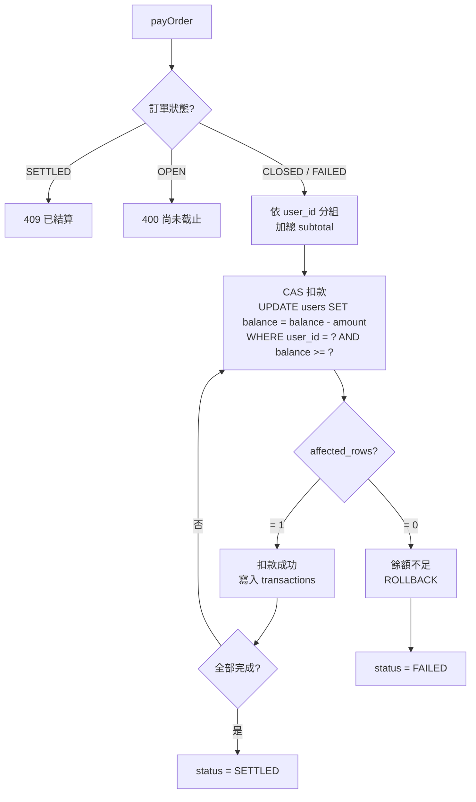
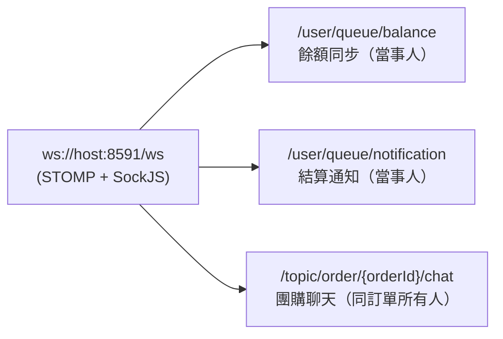
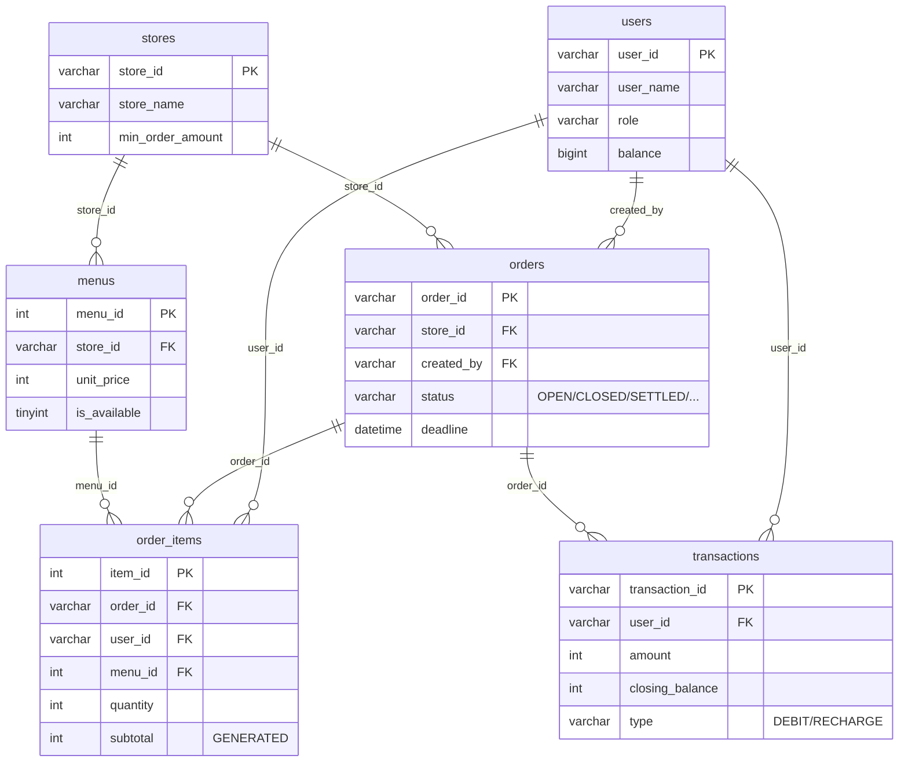

# PayPool — 團購訂單管理系統

> 以 Java 25 + Spring Boot 3.5 打造的團購 / 合資訂單平台：多人開團下單、到時自動結算、跨實例即時通知。

[](https://github.com/AlleyCC/order_sys/actions/workflows/ci.yml)


---

## 架構概覽

```
          ┌─────────────────────────────────────────┐
          │         Client (Web / Mobile)           │
          └────┬────────────────────────┬───────────┘
               │ HTTP + JWT             │ WebSocket (STOMP / SockJS)
               ▼                        ▼
 ┌──────────────────────────────────────────────────────────────┐
 │              Spring Boot 3.5  (port 8591)                    │
 │                                                              │
 │   JwtAuthFilter ─▶ Controller ─▶ Service ─▶ Mapper           │
 │                         │                                    │
 │                    @Around AOP                               │
 │                    (access log)                              │
 │                                                              │
 │        ┌──────────┬─────────────┬──────────────┐             │
 │        ▼          ▼             ▼              ▼             │
 │     Mapper    TokenRedis    RedisSettle    NotificationPub   │
 │    (MyBatis)   Service        Queue          (Pub/Sub)       │
 │        │          │             │               │            │
 └────────┼──────────┼─────────────┼───────────────┼────────────┘
          │          │             │               │
          ▼          ▼             ▼               ▼
      ┌───────┐  ┌───────┐   ┌───────────┐   ┌──────────┐
      │ MySQL │  │ Redis │   │ Scheduler │   │ WS Relay │
      │  8.0  │  │   7   │   │ (consumer)│   │ → client │
      └───────┘  └───────┘   └───────────┘   └──────────┘
```

- **Controller** 透過 `@Around` AOP 統一記錄 access log（`ApiAccessLogAspect`）
- **Token**（access blacklist + refresh session）存 Redis，走純 JWT 驗簽不查 DB
- **結算隊列** 走 Redis delay queue，`RedisSettlementConsumer` 跨實例消費
- **通知** 透過 Redis Pub/Sub 廣播，`RedisWebSocketRelay` 推送到對應 WS session

---

## 技術決策

> 三個最能說故事的決策。完整演進紀錄可見 `openspec/changes/archive/`。

### 1. Token 從 DB 遷到 Redis

- **問題**：Refresh token 原本存 `refresh_tokens` 資料表，每個 API 請求都會驗 access token，高頻讀取壓垮 DB；且 access token 撤銷（登出）需要 DB 寫入。
- **選擇**：Access token 黑名單 + Refresh token session 全部搬到 Redis，Key 帶 TTL 自動過期。
- **為何**：Redis 天生支援 `EXPIRE`、讀寫延遲遠低於 MySQL；token 本質是短期快取資料而非事實資料。

### 2. 結算隊列：in-memory `DelayQueue` → Redis delay queue

- **問題**：原先以 Java `DelayQueue` 實作自動結算觸發，單機可行，但多實例部署時同一筆訂單會被多個 consumer 同時處理，且程式重啟會遺失隊列內容。
- **選擇**：改用 Redis ZSET（score = 觸發時間），多實例用 `ZPOPMIN` 原子競爭取任務，重啟不遺失。
- **為何**：延遲觸發 + 跨實例一致 + 持久化，Redis ZSET 正好滿足這三項。

### 3. Access log 用 AOP 而不是 `@ControllerAdvice`

- **問題**：要記錄每個 API 的耗時、參數、回應大小，`@ControllerAdvice` 只有 `@ExceptionHandler` / `ResponseBodyAdvice`，沒有 `@Around` 語義，取不到「方法進入 → 方法結束」的耗時差。
- **選擇**：寫 `ApiAccessLogAspect` 以 `@Around` 切入 Controller 層，量測 `System.nanoTime()` 差。
- **為何**：AOP 的 `@Around` 才能同時拿到方法執行前後的 timestamp；未來要擴到 Service 層也是同一個切面。

---

## Quick Start

```bash
# 1) 啟動依賴（MySQL 3307 + Redis 6379）
docker compose up -d

# 2) 編譯（Flyway migration 會在啟動時自動執行）
./mvnw package -DskipTests

# 3) 執行
java -jar target/orderSystem-0.0.1-SNAPSHOT.jar
```

啟動後可直接瀏覽 **Swagger UI**：<http://localhost:8591/swagger-ui.html>

> RSA key 需放置於 `./key/` 目錄（`private_key.pem`、`public_key.pem`、`password_private.key`、`password_public.key`）。CI 以 `openssl` 臨時生成；本機請自行產生。

---

## API 文件

- **Swagger UI**：`/swagger-ui.html` — 啟動後可直接互動；右上「Authorize」按鈕貼入 access token 後可測受保護端點
- **OpenAPI JSON**：`/v3/api-docs`
- **完整規格書**：[`docs/SPEC.md`](docs/SPEC.md) — 包含商業邏輯與錯誤碼定義

---

## API 示例

### 登入並取得 token

```bash
# Authorization header 需帶 RSA 加密後的密碼（client-side 加密後 Base64）
curl -X POST http://localhost:8591/login/create_token \
  -H "Authorization: JWT <RSA_ENCRYPTED_PASSWORD_BASE64>" \
  -H "Content-Type: application/json" \
  -d '{"userId": "alley"}'
```

Response:
```json
{
  "accessToken":  "eyJhbGciOiJSUzI1NiJ9.eyJzdWIiOiJhbGxleSIsInJvbGUiOiJtZW1iZXIi...",
  "refreshToken": "550e8400-e29b-41d4-a716-446655440000"
}
```

### 建立團購訂單（需認證）

```bash
curl -X POST http://localhost:8591/order/create_order \
  -H "Authorization: Bearer <ACCESS_TOKEN>" \
  -H "Content-Type: application/json" \
  -d '{
        "storeId":   "store-001",
        "orderName": "週五下午茶",
        "deadline":  "2026-04-13T17:00:00"
      }'
```

Response:
```json
{ "orderId": "b1a2c3d4-e5f6-7890-abcd-ef1234567890" }
```

---

## 系統設計細節

### 認證流程（Access + Refresh Token）



### 訂單生命週期



### 訂單狀態流轉



### 結算扣款流程（CAS Pattern）



> 餘額扣款以 SQL CAS（Compare-And-Swap）確保高併發下的一致性：`WHERE balance >= ?` 保證不會扣成負數，失敗即 rollback 整筆訂單。

### WebSocket 訊息通道



Multi-instance 下透過 **Redis Pub/Sub** 由 `RedisWebSocketRelay` 轉送到對應實例的 WS session。

---

## Database Schema



**Enums**
- `OrderStatus`: `OPEN` → `CLOSED` → `SETTLED` / `FAILED` / `CANCELLED`
- `TradeType`: `DEBIT`（扣款）/ `RECHARGE`（儲值）

> Refresh token 原為 `refresh_tokens` 資料表，已遷移至 Redis（見「技術決策」#1）。

---

## 測試

```bash
./mvnw test                        # 全部測試（含 Testcontainers）
./mvnw test -Dtest=ClassName       # 單一 class
```

| 類型 | 工具 | 用途 |
|---|---|---|
| Service 單元測試 | JUnit 5 + Mockito | mock mapper，驗業務邏輯 |
| Controller 整合測試 | `@SpringBootTest` + MockMvc + Testcontainers | 真實 MySQL + Redis，驗完整 HTTP 流程 |
| Mapper 整合測試 | `@MybatisPlusTest` + Testcontainers | 驗複雜 SQL / XML query |

開發遵循 **TDD**：先寫測試（RED）→ 實作通過（GREEN）→ 重構（REFACTOR）。

---

## 專案結構

```
src/main/java/com/example/orderSystem/
├── aspect/         # AOP access log
├── config/         # Security, WebSocket, MyBatisPlus, OpenAPI
├── controller/     # REST endpoints
├── service/        # 業務邏輯 + Redis / Pub/Sub
├── mapper/         # MyBatis-Plus mappers
├── scheduler/      # Redis delay queue consumer
├── security/       # JWT Authentication Filter
├── websocket/      # STOMP handler + Redis relay
└── util/           # JWT / RSA / BCrypt

src/main/resources/
├── db/migration/   # Flyway migrations
└── mapper/         # MyBatis XML
```

---

## 相關文件

- [`docs/SPEC.md`](docs/SPEC.md) — 完整 API 規格 + 商業規則
- [`openspec/`](openspec/) — Change proposals / designs / specs
- [`CLAUDE.md`](CLAUDE.md) — 開發者操作指令（Flyway、DB reset 等）

## 作者

[@AlleyCC](https://github.com/AlleyCC)
