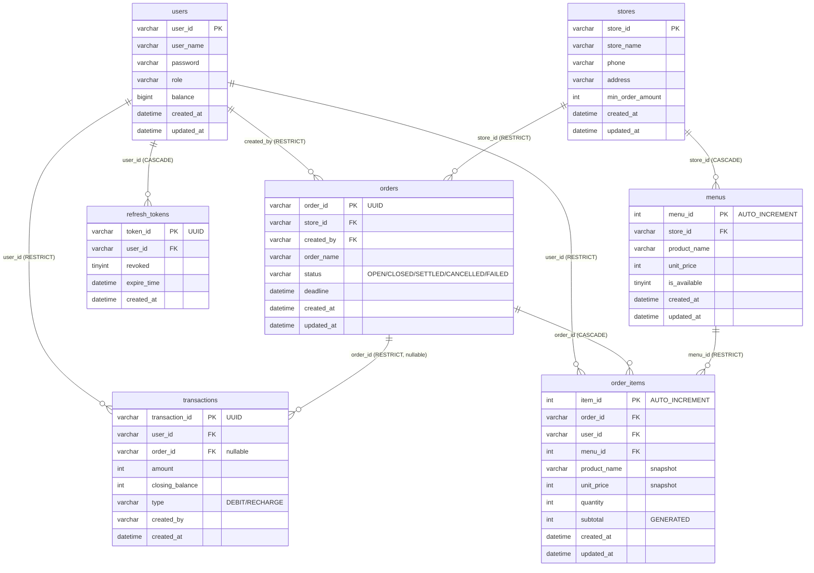
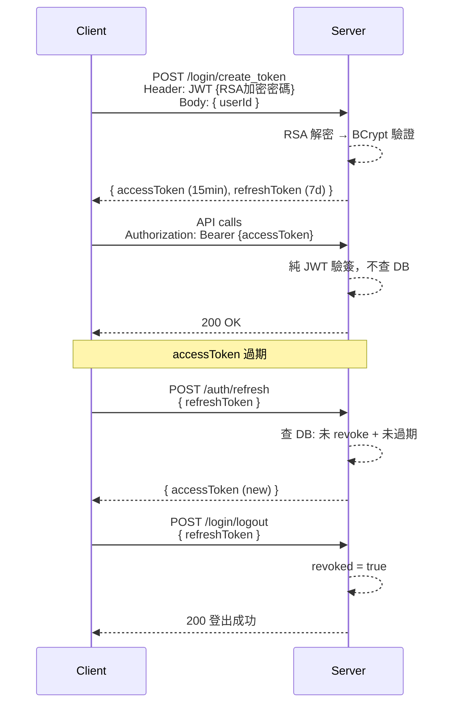
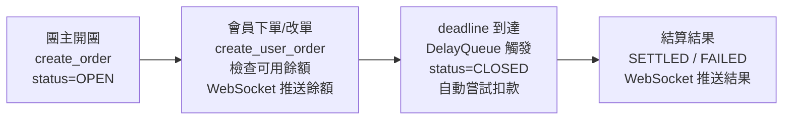
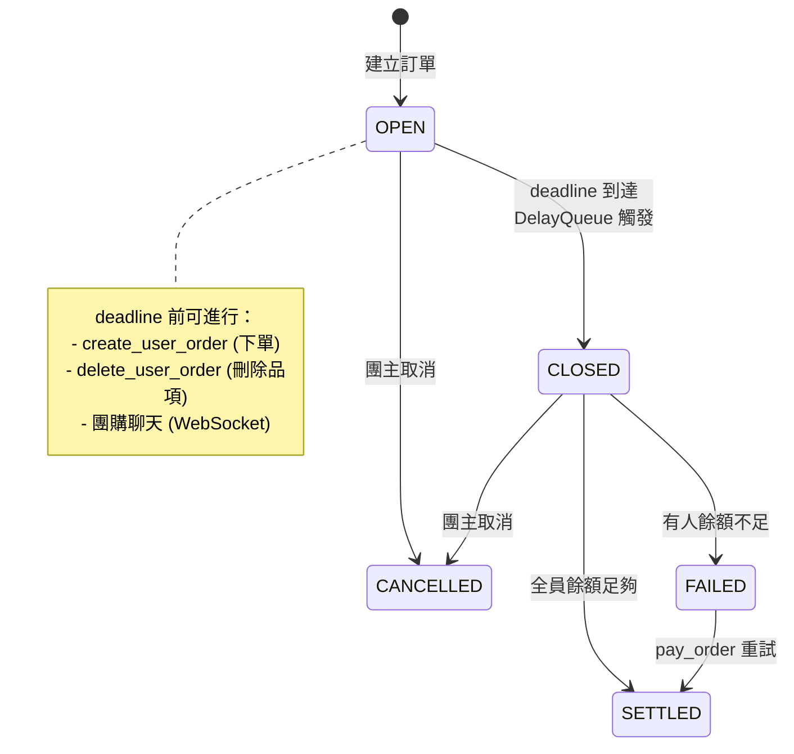
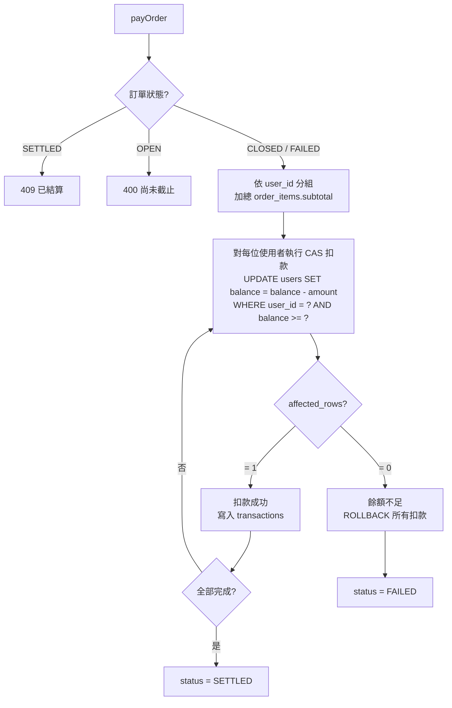
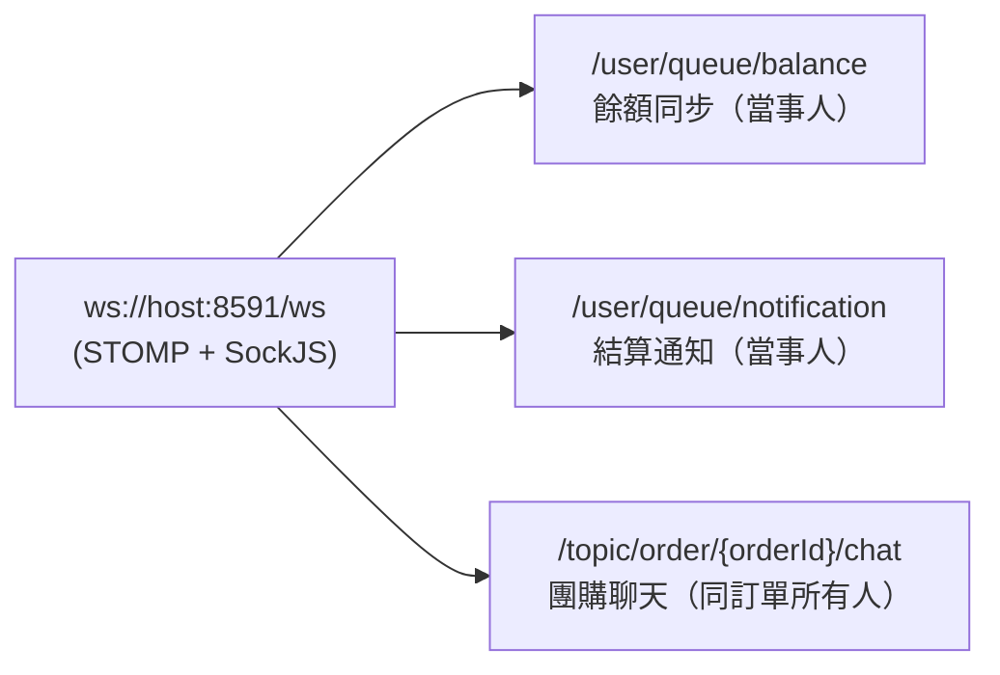

# PayPool - 團購訂單管理系統

公司內部團購/合資訂單管理系統的後端 API 服務，提供使用者認證、訂單建立與管理、帳戶餘額管理、支付結算、即時通訊等功能。

## 技術棧

| 項目 | 說明 |
|------|------|
| 語言 | Java 25 |
| 框架 | Spring Boot 3.5.13 |
| 資料庫 | MySQL 8.0 (Docker) |
| 資料存取 | MyBatis-Plus 3.5.12 |
| 認證 | JWT RS256 (Access + Refresh Token) |
| 即時通訊 | WebSocket (STOMP + SockJS) |
| 排程 | Java DelayQueue |
| 測試 | JUnit 5 + Mockito + Testcontainers |

## 前置需求

- Java 25+
- Docker (MySQL container)
- RSA key 檔案放在 `./key/` 目錄下

## 快速啟動

```bash
# 1. 啟動 MySQL (port 3307)
docker compose up -d

# 2. 編譯 + 啟動 (預設 dev profile, Flyway 自動執行 migration)
./mvnw package -DskipTests
java -jar target/orderSystem-0.0.1-SNAPSHOT.jar

# App 啟動於 http://localhost:8591
```

### Flyway 指令

```bash
./mvnw flyway:info       # 查看 migration 狀態
./mvnw flyway:migrate    # 只跑 migration，不啟動 app
./mvnw flyway:repair     # 修復 checksum 不一致
```

## API 規格

完整 API 規格書請參考：[docs/SPEC.md](docs/SPEC.md)

## Database Schema

### ERD



### Tables

| Table | 說明 | PK | 重要欄位 |
|-------|------|----|---------|
| users | 使用者 | user_id (VARCHAR) | balance (BIGINT), role |
| stores | 店家 | store_id (VARCHAR) | min_order_amount |
| menus | 菜單 | menu_id (AUTO_INCREMENT) | unit_price, is_available |
| orders | 團購訂單 | order_id (UUID) | status (VARCHAR), deadline |
| order_items | 訂單品項 | item_id (AUTO_INCREMENT) | subtotal (GENERATED) |
| transactions | 交易紀錄 | transaction_id (UUID) | type (DEBIT/RECHARGE), closing_balance |
| refresh_tokens | Refresh Token | token_id (UUID) | revoked, expire_time |

### Enums

**OrderStatus**: `OPEN` → `CLOSED` → `SETTLED` / `FAILED` / `CANCELLED`

**TradeType**: `DEBIT` (扣款) / `RECHARGE` (儲值)

## 流程圖

### 認證流程 (Access + Refresh Token)



### 訂單生命週期



### 訂單狀態流轉



### 結算扣款流程 (CAS Pattern)



### WebSocket 即時通訊



## 測試

```bash
./mvnw test                        # 全部測試
./mvnw test -Dtest=ClassName       # 單一 class
```

| 類型 | 工具 | 說明 |
|------|------|------|
| Service 單元測試 | JUnit 5 + Mockito | Mock mapper，驗證業務邏輯 |
| Controller 整合測試 | SpringBootTest + MockMvc + Testcontainers | 真實 MySQL，驗完整 HTTP 流程 |

## 專案結構

```
src/main/java/com/example/orderSystem/
├── config/          # Spring 配置 (Security, WebSocket, MyBatisPlus)
├── controller/      # REST API endpoints
├── service/         # 業務邏輯
├── mapper/          # MyBatis-Plus mappers
├── entity/          # 資料庫實體
├── dto/             # Request/Response DTOs
├── enums/           # OrderStatus, TradeType
├── exception/       # 全域例外處理 (RFC 7807)
├── scheduler/       # DelayQueue 自動結算
├── security/        # JWT Authentication Filter
├── websocket/       # 聊天 STOMP handler
└── util/            # JWT, RSA, BCrypt 工具

src/main/resources/
├── db/migration/    # Flyway migrations (V1, V2, V3)
├── mapper/          # MyBatis XML (JOIN queries)
└── application*.properties
```
